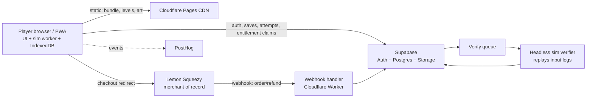

# Build Framework: The System Design of the System Design Game

Yes — designing this product is itself a system design question. Here is our own answer, written the way we'd want a player to answer: requirements first, load math, then components, then failure modes and cost.

## Requirements

- **Functional**: play levels in a browser (desktop + mobile web/PWA), anonymous play allowed, accounts for progress/XP/streaks, leaderboards, daily challenge, paid entitlements (Pro/Lifetime/Teams), level content updates without app redeploys.
- **Non-functional**: a player's first level starts **< 5 seconds after link click** (the virality constraint); the game stays playable if our backend is down; 10k concurrent players must be boring, not scary; solo-maintainer ops budget (~$0 at launch, < $150/mo at 100k MAU).

## The load-math insight that makes this cheap

**The simulation runs 100% client-side** (deterministic, seeded — decided in doc 06). The server never simulates during play. So 10k *concurrent players* generates:

| Traffic | Math | Peak load |
|---|---|---|
| Static assets (app bundle, sprites, audio, level JSON) | one CDN fetch per session, then cached | ~0 origin load — Cloudflare CDN, unmetered |
| Progress saves | autosave every ~2 min/player → 10k / 120s | ~85 RPS of tiny indexed upserts |
| Level completions (attempt + replay log upload) | one per 8-min avg level → 10k / 480s | ~20 RPS writes, payloads 1–50 KB |
| Leaderboard reads | cached at edge, 30–60s TTL | ~0 DB load |
| Auth token refresh | hourly per session | ~3 RPS |

**Total: ~100–150 RPS of simple indexed Postgres operations.** A single Supabase Pro instance handles thousands of these per second. There is no scaling story to build for years — the architecture's whole trick is that *the expensive part (simulation) is the player's CPU*. If we're ever forced to scale, the seams are already cut: reads go through edge cache, writes are idempotent upserts (safe to queue), and replay verification (below) is fully async.

## Architecture

## Key design decisions (each one is a defended trade-off)

1. **Local-first progress.** All gameplay state (attempts, XP events, streak ticks) writes to IndexedDB first, then syncs via idempotent upserts keyed by client-generated UUIDs. Consequences: the game works offline and during our outages (our backend going down does *not* stop play — we eat our own resilience dog food); anonymous → account upgrade is just "attach the local event log to a new user id"; sync retries are safe by construction.
2. **Server-authoritative only where money or fame is involved.** XP and stars are client-computed and client-trusted (low stakes, anomaly-checked). **Leaderboard placement is only granted after server-side verification**: the client uploads `{level_hash, sim_version, seed, input_log}` (kilobytes), an async worker replays it in the headless engine and confirms the claimed score. Cheating a global leaderboard requires beating a deterministic replay — not worth anyone's time. Verification is batched and lazy (top-N and new-high-scores first).
3. **Levels are content, not code.** Level JSON ships on the CDN keyed by content hash; the app fetches a signed catalog manifest. New levels and balance patches deploy without touching the app bundle. Replays pin `(level_hash, sim_version)` so old runs stay valid forever.
4. **Payments via merchant of record, entitlements as our own table.** Lemon Squeezy hosted checkout → webhook (verified, idempotent, raw events archived) → `entitlements` row → client fetches entitlement claims at session start and caches them locally (grace period for webhook lag, offline tolerance). Steam/Apple later write into the *same* entitlements table — one truth, many storefronts. No payment logic in the client beyond "is entitled?"
5. **Anonymous-first funnel.** No signup wall before the first "aha" — first level playable instantly, account prompt arrives at the moment there's something to lose (progress worth saving, a score worth ranking).

## Failure modes of our own system (and answers)

| Failure | Blast radius | Answer |
|---|---|---|
| Supabase outage | Sync + leaderboards + login pause | Local-first: play continues, queue drains on recovery |
| CDN outage | Nothing loads | PWA service-worker cache serves last-good bundle + owned levels to returning players |
| Webhook lag/loss | Paid user not entitled | Client-side purchase receipt grace + reconciliation poll against LS API |
| Verifier backlog | Leaderboards update slowly | Degrade to "provisional" badges; verification is never on the play path |
| Viral spike (HN front page) | 50× traffic in an hour | All spike traffic is CDN-static; API load grows only with *completed levels* — inherently smoothed |

## Cost model

| Scale | Monthly cost |
|---|---|
| Launch–1k MAU | ~$0 (Supabase free, Cloudflare free, LS per-transaction) |
| 10k MAU | ~$25–45 (Supabase Pro, Workers paid) |
| 100k MAU | ~$100–150 (DB compute + storage for replays; PostHog volume) |

Replay storage is the only thing that grows unboundedly — retention policy: keep forever for personal bests and leaderboard entries, 90 days for the rest.

## Deliberately not built (yet)

Realtime multiplayer infra, user-generated-content storage/moderation, regional data residency, custom auth. Each gets designed when its phase arrives (doc 07) — right-sized for stated requirements, exactly the discipline the game teaches.
